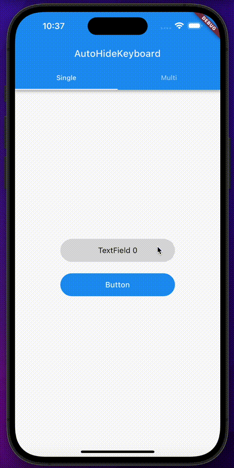

# AutoHideKeyboard

[](https://pub.dev/packages/auto_hide_keyboard)
[](https://opensource.org/licenses/MIT)

A Flutter package that automatically hides the soft keyboard when the user taps outside of text input fields or scrolls the page.

## Features

- 🎯 **Smart Detection**: Automatically hides keyboard when tapping outside TextField widgets
- 🎛️ **Multi-Input Support**: Works seamlessly with multiple TextFields on the same screen
- 🔄 **Scroll Support**: Dismisses keyboard on page scroll for better UX
- 🎨 **Zero Configuration**: Works out of the box with minimal setup

## Preview

Try it online: [https://flutter-auto-hide-keyboard.vercel.app](https://flutter-auto-hide-keyboard.vercel.app)



## Installation

Add `auto_hide_keyboard` to your `pubspec.yaml`:

```yaml
dependencies:
  auto_hide_keyboard: ^1.1.0
```

Then run:

```bash
flutter pub get
```

## Usage

### Basic Usage

Simply wrap your `TextField` with `AutoHideKeyboard`:

```dart
import 'package:auto_hide_keyboard/auto_hide_keyboard.dart';

AutoHideKeyboard(
  child: TextField(
    decoration: InputDecoration(
      hintText: 'Enter your text here',
    ),
  ),
)
```

### Multiple TextFields

The package works seamlessly with multiple input fields:

```dart
Column(
  children: [
    AutoHideKeyboard(
      child: TextField(
        decoration: InputDecoration(hintText: 'First name'),
      ),
    ),
    SizedBox(height: 16),
    AutoHideKeyboard(
      child: TextField(
        decoration: InputDecoration(hintText: 'Last name'),
      ),
    ),
  ],
)
```

### Custom Safe Padding

You can customize the touch area around TextFields using `safePadding`:

```dart
AutoHideKeyboard(
  safePadding: EdgeInsets.all(20), // Custom padding around the TextField
  child: TextField(
    decoration: InputDecoration(hintText: 'Enter text'),
  ),
)
```

## API Reference

### AutoHideKeyboard

| Property      | Type          | Default                    | Description                                                 |
| ------------- | ------------- | -------------------------- | ----------------------------------------------------------- |
| `child`       | `Widget`      | **required**               | The TextField widget to wrap                                |
| `safePadding` | `EdgeInsets?` | `EdgeInsets.only(top: 48)` | Additional padding around the TextField for touch detection |

## How It Works

AutoHideKeyboard uses a combination of:

1. **Global pointer detection** to monitor touch events outside TextField areas
2. **Visibility detection** to track which TextFields are currently visible
3. **Focus management** to properly dismiss the keyboard when appropriate

The implementation is inspired by Flutter's `Tooltip` widget.

## License

[MIT](LICENSE) License © 2024-PRESENT Del Wang

